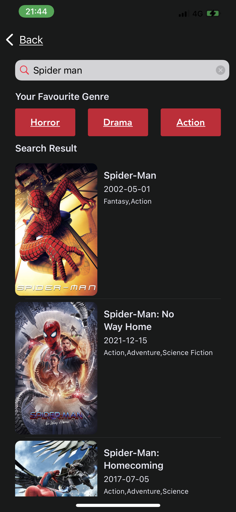

<!-- PROJECT LOGO -->
<br />
<div align="center">
  <a href="https://github.com/github_username/repo_name">
    
  </a>

<h3 align="center">Movie Hub</h3>

  <p align="center">
    A simple movie browsing/movie suggesting app
  </p>
</div>


<!-- TABLE OF CONTENTS -->
<details>
  <summary>Table of Contents</summary>
  <ol>
    <li>
      <a href="#about-the-project">About The Project</a>
      <ul>
        <li><a href="#built-with">Built With</a></li>
      </ul>
    </li>
    <li>
      <a href="#getting-started">Getting Started</a>
      <ul>
        <li><a href="#prerequisites">Prerequisites</a></li>
        <li><a href="#installation">Installation</a></li>
      </ul>
    </li>
    <li><a href="#usage">Usage</a></li>
    <li><a href="#roadmap">Roadmap</a></li>
  </ol>
</details>


<!-- ABOUT THE PROJECT -->
## About The Project

       
      


Hi there, this is my first project ever that solves absolutely 0 problems; However, I made this app for showcase purposes only, to demonstrate the skills I've learned so far.
The app is created with an MVC design pattern, using moviesDB free API.

while working on this app I've learned/ mastered: 
* Passing data and communication between objects using Delegation pattern
* Observer and Notification pattern
* Building UI with programmatical approach only 
* Communication patterns with closures

and much more... but I think I've listed the most important ones. The app is not in a final state; I'm going to implement more features which I'll list below in my roadmap

Libraries I've used:
* MSPeekCollectionViewDelegateImplementation
* MarqueeLabel
* RevealMenuController 


<p align="right">(<a href="#top">back to top</a>)</p>


### Built With

* Xcode 13
* Swift programming language

<p align="right">(<a href="#top">back to top</a>)</p>


<!-- GETTING STARTED -->
## Getting Started

To run the app you'll need your own moviesDB api key and xcode 13.2 + 


### Installation

1. Get a free API Key at [https://www.themoviedb.org](https://www.themoviedb.org)
2. Clone the repo
   ```sh
   git clone https://github.com/Sevenfortyseven/Movies-App.git
   ```
3. Install pods using CocoaPods

   ```sh
   $ pod install
   ```
4. Enter your API in `config.swift`
   ```js
   let API_KEY = 'ENTER YOUR API';
   ```

<p align="right">(<a href="#top">back to top</a>)</p>


<!-- ROADMAP -->
## Roadmap

- [x] Search Movies/TV shows
- [x] Dark/Light mode
- [ ] User authorisation
- [ ] Downloads


